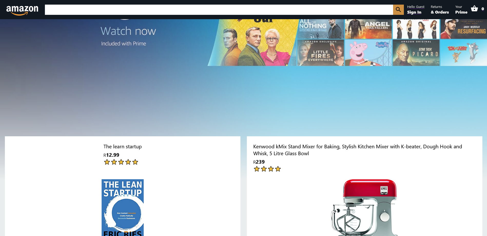

# Amazon clone page

This is an Amazon clone challenge by the [Clever programmer youtube channel](https://www.youtube.com/c/CleverProgrammer) using React Js and Firebase.

## Table of contents

- [Overview](#overview)
  - [The challenge](#the-challenge)
  - [Screenshot](#screenshot)
  - [Links](#links)
- [My process](#my-process)
  - [Built with](#built-with)
  - [What I learned](#what-i-learned)
  - [Continued development](#continued-development)
  - [Useful resources](#useful-resources)
- [Author](#author)
- [Acknowledgments](#acknowledgments)

**Note: Delete this note and update the table of contents based on what sections you keep.**

## Overview

### The challenge

Users should be able to:

- View the optimal layout for the site depending on their device's screen size
- See hover states for all interactive elements on the page
- Add items to the cart
- View the cart and remove items from it
- User can login and logout
- Go to Checkout (Can proceed to checkout but the payment process is not complete because stripe is not setup)

### Screenshot



### Links

- Solution URL: [Add solution URL here](https://github.com/Momzit/amazonclone)
- Live Site URL: [Add live site URL here](https://clone-project-b8fd5.firebaseapp.com/)

## My process

### Built with

- CSS custom properties
- Flexbox
- CSS Grid
- [React](https://reactjs.org/) - JS library

### What I learned

I learned about React Js context API and Redux. These concepts help eliminate the need for passing in props and prop drilling, especially when you are working with a more complex project. Context API and Redux provide a global data "storage" whereby all the children of the component surrounded by the stateProvider can access without the need to pass in props. Redux provides a dispatch method that allows for different actions to be triggered such that the context can be updated according to the action perfomed. An example is shwon below for an action of removing an item from a basket (cart) using a reducer function

```js
const reducer = (state, action) => {
  switch (action.type) {
    case "REMOVE_FROM_BASKET":
      const index = state.basket.findIndex(
        (basketItem) => basketItem.id === action.id
      );
      let newBasket = [...state.basket];
      if (index >= 0) {
        newBasket.splice(index, 1);
      } else {
        console.warn(`Product with (id: ${action.id}) is not in the cart`);
      }
      return {
        ...state,
        basket: newBasket,
      };
    default:
      return state;
  }
};
```

### Continued development

I still need to learn more about context api and redux because I think they make working with states and managing them way easier. I also want to get the stripe payment method working in the future.

### Useful resources

- [Example resource 1](https://www.youtube.com/watch?v=RDV3Z1KCBvo&t=30598s&ab_channel=CleverProgrammer) - This is the video I was following along.

## Author

- Website - [Moment](https://clone-project-b8fd5.firebaseapp.com/)
- GitHub - [@Momzit](https://github.com/Momzit)

## Acknowledgments

Thanks to clever programmer for this incredible video that illustrates important concepts about React Js, and how to deploy a project to firebase and implement payment process with stripe.
